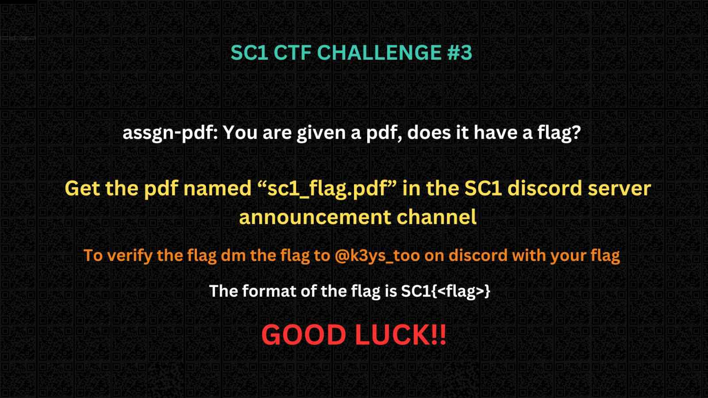
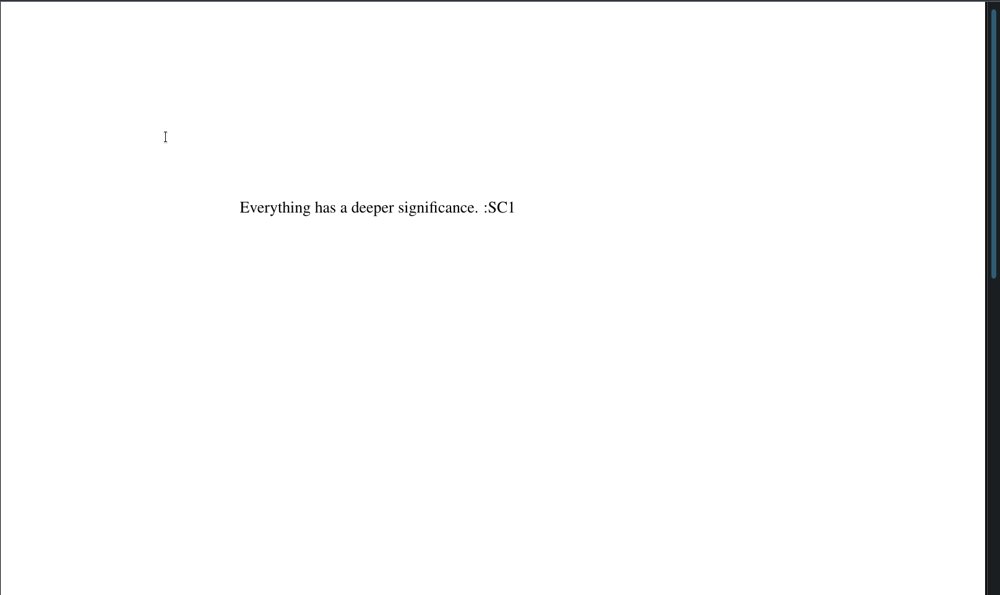

# Status Code CTF Challenge 3 Writeup

Problem statement:


We are given:

- a PDF `sc1_flag.pdf`
- The message -> "You are given a pdf, does it have a flag?"

## Setup

Opening the PDF in a regular PDF viewer reveals nothing useful:



## Solution

Let's examine the metadata of the PDF using the UNIX [`pdfinfo`](https://linux.die.net/man/1/pdfinfo) command.

```console
pdfinfo sc1_flag.pdf     
Title:           
Subject:         
Keywords:        
Author:          
Creator:         
Producer:        283548893274
CreationDate:    Sun Aug 25 12:42:57 2024 IST
ModDate:         Sun Aug 25 12:42:57 2024 IST
Custom Metadata: yes
Metadata Stream: no
Tagged:          no
UserProperties:  no
Suspects:        no
Form:            none
JavaScript:      yes
Pages:           1
Encrypted:       no
Page size:       612 x 792 pts (letter)
Page rot:        0
File size:       12836 bytes
Optimized:       no
PDF version:     1.5
```

Everthing seems fine except the `JavaScript` field which is set to yes. We can examine it more using the `-js` flag.

```console
pdfinfo -js sc1_flag.pdf
Name Dictionary "01 c":
console.log("U0Mxe1kwdV9UNGxrM2RfVzF0aF9UaDNfU2NyMGxsfQo=")
```

This is an encoded string. We can find the type of encoding using the cipher identifier from [dCode](https://www.dcode.fr/cipher-identifier).

This is a `base64` encoded string. Let's decode it.

```console
base64 -d  <<< U0Mxe1kwdV9UNGxrM2RfVzF0aF9UaDNfU2NyMGxsfQo=                                                                                  
SC1{Y0u_T4lk3d_W1th_Th3_Scr0ll}
```

We got the flag!
